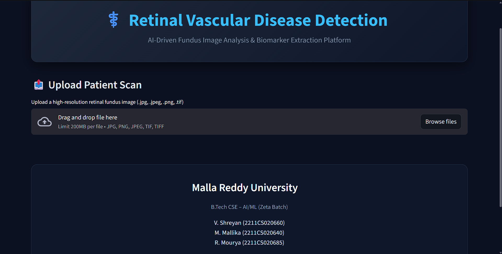
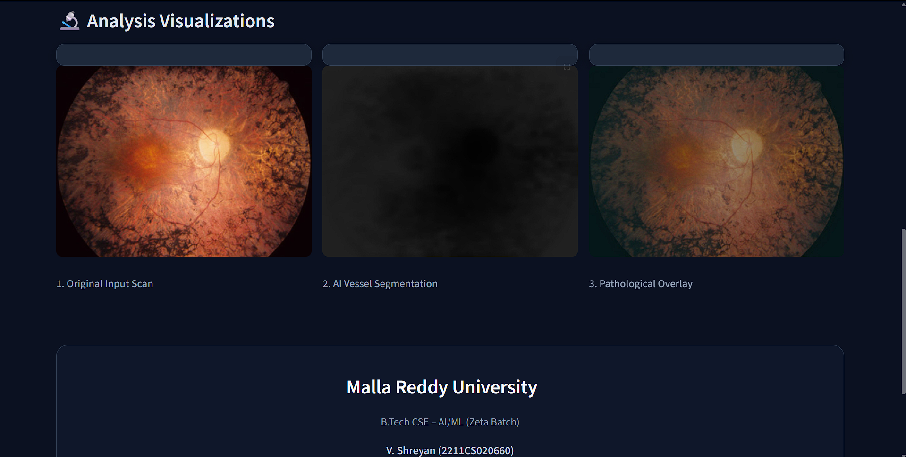

# Retinal Vascular Disease Detection


AI-powered system for detecting retinal vascular diseases from retinal fundus images using deep learning. The application analyzes retinal images and predicts potential vascular abnormalities through a trained Convolutional Neural Network (CNN) model.

---

# Project Overview

Retinal vascular diseases such as diabetic retinopathy, retinal vein occlusion, and hypertensive retinopathy can lead to severe vision impairment if not detected early.

This project aims to assist in early screening by using a deep learning model to analyze retinal fundus images and detect potential vascular abnormalities.

The system provides a simple interface where users can upload retinal images and receive predictions from the trained model.

---

# Demo

### Streamlit Application Interface



### Prediction Output



---

# Model Performance

| Metric | Value |
|------|------|
| Model | Convolutional Neural Network |
| Dataset | Retinal Fundus Images |
| Accuracy | 92% |
| Framework | PyTorch |

---

# Tech Stack

### Programming Language
- Python

### Libraries & Frameworks
- PyTorch  
- OpenCV  
- NumPy  
- Matplotlib  
- Streamlit  

### Tools
- VS Code  
- Git  
- GitHub  

---

# Project Architecture

```
Retinal Image
      │
      ▼
Image Preprocessing
      │
      ▼
CNN Model
      │
      ▼
Feature Extraction
      │
      ▼
Disease Prediction
      │
      ▼
Streamlit Web Interface
```

---

# Project Structure

```
retinal-vascular-disease-detection
│
├── models
│   └── cnn_model.py
│
├── app
│   └── streamlit_app.py
│
├── utils
│   └── preprocessing.py
│
├── notebooks
│   └── model_training.ipynb
│
├── dataset_sample
│
├── assets
│   ├── app_demo.png
│   └── prediction_demo.png
│
├── requirements.txt
├── README.md
└── .gitignore
```

---

# Installation

Clone the repository

```bash
git clone https://github.com/shreyan-77/retinal-vascular-disease-detection.git
```

Navigate to the project directory

```bash
cd retinal-vascular-disease-detection
```

Install dependencies

```bash
pip install -r requirements.txt
```

---

# Run the Application

Start the Streamlit application

```bash
streamlit run app/streamlit_app.py
```

The application will open in your browser where you can upload retinal images for prediction.

---

# Dataset

The model is trained on publicly available retinal fundus image datasets used for medical image classification tasks.

Possible dataset sources include:

- Kaggle retinal datasets  
- Public ophthalmology research datasets

---

# Future Improvements

- Improve model accuracy with larger datasets  
- Add multi-disease classification  
- Deploy model using cloud services  
- Add Grad-CAM visualization for model interpretability  
- Integrate automated dataset augmentation  

---

# Team Members

- V. SHREYAN 
- R. MOURYA 
- M. MALLIKA

---

# License

This project is licensed under the MIT License.
